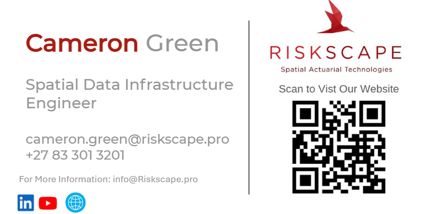

# Mapping Wildfire Risk in South Africa: A QGIS Student Workbook — Before Day 1

*A 4-day introductory workshop (Tuesday to Friday) that teaches first-year students to map, analyse, and model wildfire risk in South Africa using real data and QGIS.*

## Note to the Riskscape Team (remove before printing for students)

- Students build their own QGIS project from scratch each day, loading and styling layers themselves rather than opening a pre-built project file. This is deliberate: the loading, styling, and layer-ordering steps are part of what they're meant to practise.
- Distribute the full data folder for your chosen province (Western Cape recommended) to every student before Day 1 begins. Students will add layers into their own projects directly from this folder, so if it goes missing or gets restructured, layers will fail to load.
- Tell students to copy the folder to their Desktop and leave the internal file and folder names exactly as given. Renaming or moving individual files inside the folder is the single most common cause of "broken layer" problems on Day 1 morning.
- The Day 1 extension challenge (rainfall seasonality zones) and the Day 3 extension challenge (a slope layer derived from the static grid — the fixed set of terrain and climate layers behind the trained model — and/or a Fire Weather Index (FWI) severity raster) both need extra data layers that are not part of the core package described below. Only add those layers to the folder if you want students to be able to attempt those specific extensions.
- This workbook is split into one file per day: `README.md` (this file), `Day_1.md`, `Day_2.md`, `Day_3.md`, `Day_4.md`, plus a shared `Appendices.md` (cheat sheet, troubleshooting, glossary, and the Riskscape team's photo list).

## Before Day 1 — Getting Ready

Welcome. Over the next few days you're going to work with real wildfire data from South Africa, the same data used by Riskscape, a risk analytics company, to build an actual fire severity model that is used today. Every day, a NASA satellite instrument called VIIRS scans the country and detects heat signatures from fires. A clustering algorithm stitches together the detections that belong to the same fire into a single "fire event," and this has been happening since 2012. Riskscape combines thousands of these fire events with climate and terrain data and trains a machine learning model that predicts, for every 500 metre patch of the country, how severe a fire is likely to be in each season.

You're going to start at the end of that pipeline, by exploring the finished model's output, and then work backwards to understand where the numbers actually came from. By Day 3, you'll build a small version of that model yourself. None of this requires any GIS or programming experience. That's exactly what this first section is for: getting your computer ready so you can dive straight into the real work on Day 1.

Here's the shape of the whole workshop:

| Day | Focus | Deliverable |
|---|---|---|
| Day 1 | GIS foundations: load, explore, style, and lay out a map | A styled fire event map with one written observation |
| Day 2 | Spatial analysis: connect fire to the landscape | A 4-panel seasonal severity map with written observations |
| Day 3 | Raster analysis: build your own risk model | A composite risk map compared to the trained model output |
| Day 4 | Capstone: same data, two client stories | Two slide decks (one per brief) with speaker notes, built individually |

Each day runs for about 6 working hours, split into two 2.5 hour sessions with a break in between.

### What is GIS?

A geographic information system, or GIS, is just software that stores and displays information tied to real places on a map, rather than in a plain spreadsheet or document. Underneath, almost all mapped data comes in one of two basic forms: vector data, which is points, lines, and shapes (like a dot for a city or an outline for a country), and raster data, which is a grid of pixels, each holding a value (like a satellite image or a temperature map). Don't worry about memorising that distinction right now. You'll meet vector data properly on Day 1 and raster data on Day 2.

### Installing QGIS

QGIS is the free, open-source GIS software you'll use for the whole workshop. Someone from the Riskscape team will give you the installer on a USB flash stick, so you won't need to download anything yourself. Follow these steps before Day 1 so you're not installing software while everyone else is already working.

1. Plug in the USB flash stick the Riskscape team gives you and copy the QGIS installer onto your Desktop.
2. The installer is the **Long Term Release**, sometimes shortened to **LTR**. This is the most stable version of QGIS, which matters more than having the latest features for a workshop like this — don't swap it out for a different version even if you find one online.
3. Run the installer once it's copied over, and accept all the default options as you click through it. There's no need to change any settings.
4. Once installation finishes, open QGIS from your Start menu or Applications folder.
5. Confirm that QGIS launches successfully to an empty map window, with menus across the top and panels down the sides but no data loaded yet.

> **Photo 1 — QGIS Empty Launch.** See the [Photo List appendix](Appendices.md#photo-1) for exactly what to capture.

> **Checkpoint:** You know the install worked if QGIS opens to a blank map canvas within a few seconds, with no error messages. You don't need to click anything else yet, just confirm it opens.

> **Hint:** If QGIS won't open or crashes immediately, restarting your computer fixes the problem more often than you'd expect. If it still won't open after that, flag it with the Riskscape team before Day 1 rather than on the morning itself.

### Getting Your Data Folder

Someone from the Riskscape team will give you the workshop data folder before Day 1, by USB stick, a shared drive, or a download link, whichever has been arranged for your class.

1. Copy the **entire folder** onto your Desktop. Don't just copy individual files out of it.
2. Don't rename the folder, and don't rename or move any files inside it. You'll be loading layers into QGIS directly from this folder, by file path, throughout the workshop.
3. Open QGIS and create a new, empty project. Save it somewhere sensible (your Desktop is fine) so you can find it again — you'll build each day's project yourself from this blank starting point.

> **Photo 2 — New Empty Project Saved.** See the [Photo List appendix](Appendices.md#photo-2) for exactly what to capture.

### What's in Your Data Folder

Here's a plain-language guide to what you'll find inside, so the file names mean something before you even open them:

- **sa_boundary.gpkg** — the outline of the whole of South Africa. You'll use this just for context, so you always know where in the country you're looking.
- **province_boundary.gpkg** — the outline of the one province this workshop focuses on, the Western Cape, already cut out from the national boundary for you.
- **fire_events_clean.gpkg** — the star of the show. Every polygon (a mapped shape with an outline, used to represent an area) in this file is one real wildfire, going all the way back to 2012. Each one carries information in columns including `area_km2` (how big the fire was, in square kilometres), `days_burned` (how many days it burned for), and `start_date` (when it began).
- **fire_ignitions.gpkg** — one point per fire event, marking roughly where that fire is believed to have started.
- **bioregions.gpkg** — the Western Cape divided up into ecological zones called bioregions or biomes (think Fynbos or Savanna), taken from South Africa's national vegetation map. This tells you what kind of landscape and vegetation each fire happened in.
- **severity_rasters/severity_mean_summer.tif**, **severity_mean_autumn.tif**, **severity_mean_winter.tif**, **severity_mean_spring.tif** — the actual output of Riskscape's trained fire severity model, one file per season, inside the `severity_rasters` subfolder. Each is a raster (a grid of pixels), and each pixel is a prediction of how many square kilometres are likely to burn per day at that spot.
- **ndvi_rasters/ndvi_summer.tif** (and the autumn/winter/spring equivalents) — a vegetation greenness index called NDVI (Normalised Difference Vegetation Index), built from satellite imagery and averaged over many years, inside the `ndvi_rasters` subfolder. High values mean lush, green vegetation; low values mean dry or sparse vegetation. This is one of the clues the model uses to predict fire severity.
- **District_Municipal_Boundary.gpkg** — South Africa's district municipalities (the mid-level administrative regions between a local municipality and a province, introduced in Day 3). The municipality name is in the `adm2_name` field.

Every layer in your folder already uses the same coordinate system (a shared way of describing locations on Earth, called EPSG:4326), so everything lines up correctly on the map with no extra work from you.

> **Watch out:** It's tempting to peek inside the folder and start dragging in whatever files look interesting. Resist that urge for now — each day's instructions tell you exactly which layers to load and in what order, so your layers, colours, and labels stay comparable to everyone else's in the room.

### You Are Ready for Day 1 When...

- QGIS is installed on your laptop and you've confirmed it opens to an empty map window.
- Your workshop data folder is copied, unchanged, onto your Desktop.
- You've created and saved a blank QGIS project of your own, ready to build on.
- You've got a rough idea of what a fire event, a bioregion, and a raster grid are, even if the details are still fuzzy. That's exactly where Day 1 picks up.

---

## Get in Touch

If anything from this week sparks a question later — about GIS, about this dataset, about where to go next — feel free to reach out.

Connect on LinkedIn: [linkedin.com/in/cameronlgreen](https://www.linkedin.com/in/cameronlgreen/)

Email: [cameron.green@riskscape.pro](mailto:cameron.green@riskscape.pro)

---

Continue to [Day 1](Day_1.md). For the QGIS cheat sheet, troubleshooting guide, and glossary, see [Appendices](Appendices.md).
